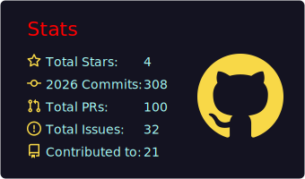
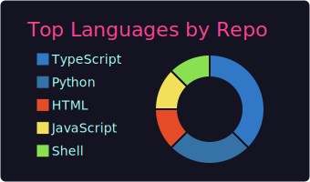
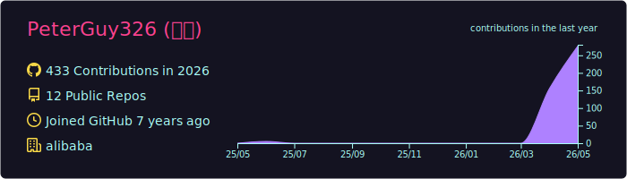
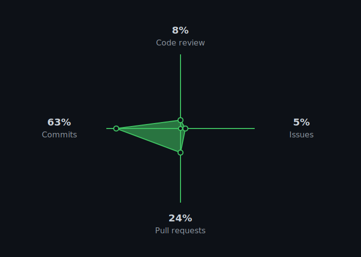
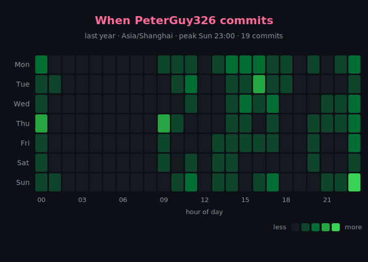

  

  &nbsp;
  &nbsp;
  &nbsp;
  &nbsp;
  &nbsp;
  &nbsp;
  &nbsp;
  &nbsp;
  

<table>
  <tr>
    <td width="35%"> </td>
    <td width="65%"> </td>
  </tr>
</table>

<table>
  <tr>
    <td width="50%"></td>
    <td width="50%"></td>
  </tr>
</table>

  

  <picture>
    <source media="(prefers-color-scheme: dark)" srcset="https://raw.githubusercontent.com/PeterGuy326/PeterGuy326/output/github-snake-dark.svg" />
    <source media="(prefers-color-scheme: light)" srcset="https://raw.githubusercontent.com/PeterGuy326/PeterGuy326/output/github-snake.svg" />
    
  </picture>

## Open Source Contributions / 开源贡献

### NousResearch/hermes-agent — DingTalk Gateway

I authored the DingTalk gateway integration and QR-code auth support for [NousResearch/hermes-agent](https://github.com/NousResearch/hermes-agent). The work was squashed upstream without a `Co-authored-by` trailer — the original authored commits remain on my fork as timestamped evidence.

**Original commits** (authored as `修雨 <huyizhou.hyz@alibaba-inc.com>`):

| Date (UTC) | SHA | Description |
|---|---|---|
| 2026-04-12 12:09:50 | [`94666e0f`](https://github.com/PeterGuy326/hermes-agent/commit/94666e0f) | feat(gateway): 增加钉钉平台配置及支持 |
| 2026-04-15 01:27:09 | [`fbcea2ef`](https://github.com/PeterGuy326/hermes-agent/commit/fbcea2ef) | fix(dingtalk): accept oapi.dingtalk.com webhook domain for stream mode reply routing |
| 2026-04-15 01:29:43 | [`4cd402f9`](https://github.com/PeterGuy326/hermes-agent/commit/4cd402f9) | fix(dingtalk): adapt message handler to dingtalk-stream SDK CallbackMessage format |
| 2026-04-15 01:33:49 | [`43d7d5d9`](https://github.com/PeterGuy326/hermes-agent/commit/43d7d5d9) | feat(dingtalk): add QR code scan authorization for setup wizard |

**Upstream squash merge** (no co-author trailer): [`9deeee7b`](https://github.com/NousResearch/hermes-agent/commit/9deeee7b)

See [AUTHORSHIP.md](https://github.com/PeterGuy326/hermes-agent/blob/authorship-record/AUTHORSHIP.md) in my fork for the full record.

  

